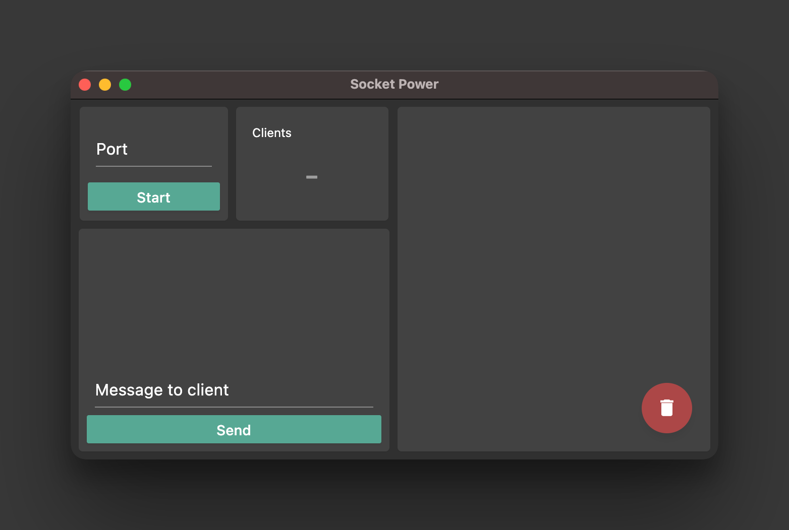

# Socket Power

Socket Power is a logging utility for developers working with WebSockets. Specify the port and start a lightweight WebSocket server that logs messages from connected clients. You can also send messages to clients from Socket Power.

